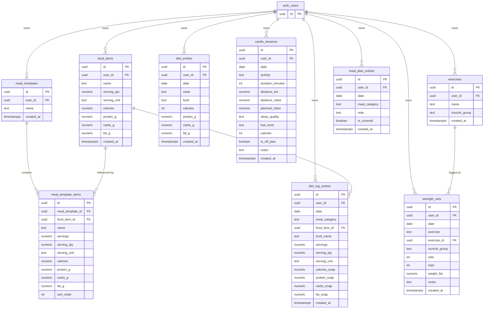

# Data Model

This document describes the Life Apps database schema and how all tables relate to each other.

## Entity Relationship Diagram

## Table Descriptions

| Table | Purpose |
|---|---|
| `food_items` | Reusable food library — nutritional info per serving |
| `meal_templates` | Named collections of foods (e.g. "Pre-swim breakfast") |
| `meal_template_items` | Line items inside a meal template; snapshotted macros allow templates to evolve independently |
| `diet_log_entries` | Daily food log — each row is one food eaten at one meal. Macros are snapshotted at log time so historical records are stable even if `food_items` changes |
| `diet_entries` | **Legacy** — replaced by `diet_log_entries`. Kept for historical data only |
| `cardio_sessions` | One row per swim session; tracks distance, planned vs actual, sleep quality, and fuel level |
| `exercises` | Exercise library — reusable exercises tagged with a muscle group (back, bis, chest, tris, shoulders, legs) |
| `strength_sets` | One row per set per session; tracks exercise, muscle group, sets, reps, and weight in lbs |
| `meal_plan_entries` | Weekly meal coverage plan — one row per meal slot per day. Tracks note and covered status. Slots already logged in `diet_log_entries` are auto-marked covered at display time |

## Row-Level Security

Every table has RLS enabled with the policy `auth.uid() = user_id`. Users can only ever read and write their own rows.
